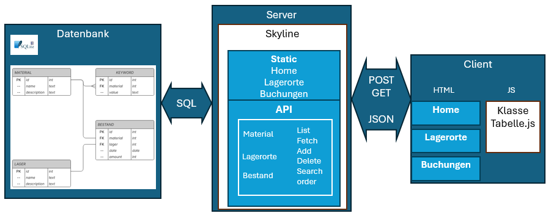
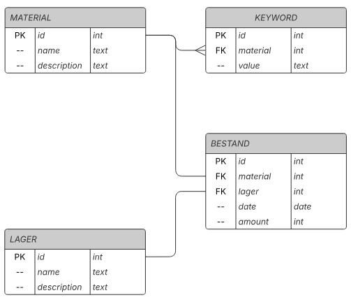
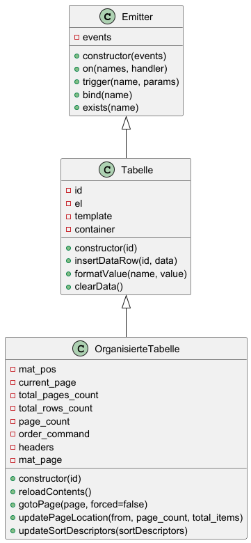

# WLW Projekt

_Kleinteile-Lager System_

## Abstract

In diesem Projekt wird ein Kleinteilelager-Buchungssystem vorgestellt, welches es erlaubt, Teile zu erfassen,
Bestände zu buchen sowie Lagerorte hinzuzufügen oder zu löschen. Auf Basis von einer Datenbank im Hintergrund stellt es
einen Server in PHP zur Datenbankanbindung dar sowie einen Client, der die Informationen anzeigen und bearbeiten kann.

## Allgemeine Funktionsweise

Die Applikation stellt ein einfaches Buchungssystem für ein Kleinteilelager dar. Es ist angedacht,
dass zu einem späteren Zeitpunkt das Lager automatisiert wird, und dieses Projekt soll die Datenbank-Grundlage legen.



Grundsätzlich fungiert der Server als Anbindung an eine SQLite-Datenbank, in welcher Teile erfasst werden. Der Umfang
der Datenbank beinhaltet Material, Lagerorte und Bestand. Ausserdem können Keywords erfasst und dem Material zugeordnet
werden, welche als Suchhilfe verwendet werden können. Die Keyword-Funktionalitäten sind im Client mangels Zeit nicht
umgesetzt.


Der Client stellt die Informationen der Datenbank zur Verfügung. Ausserdem kann bei ihm Material Zu- oder Abgebucht,
Neues Material/Lagerorte angelegt oder auch geändert werden. Die einzelnen Teile sind in den folgenden Kapitel näher
beschrieben.

## Server

Dieses Projekt wurde mit [PHP 8.2](https://www.php.net/manual/de/) als WebServer Sprache aufgesetzt.

Folgende Komponenten sind Teil davon:

- Bootstrap Styling (CSS und JS)
  Framework [https://getbootstrap.com](https://getbootstrap.com/docs/5.3/getting-started/introduction/)
- jQuery Basic Javascript Framework [https://jquery.com](https://jquery.com)
- Skyline CMS (von Thomas)

Das Skyline CMS ist ein bereits exisierendes, vorgängig von T.Abplanalp erstelltes Framework
basierend auf der Sprache PHP. Es stellt alle grundsätzlichen Funktionalitäten eines Servers
zur Verfügung wie static hosting, abstrakte API, Sicherheit, etc., welche vonnöten sind um
einen Server auch in der Öffentlichkeit zu deployen. Eine Beschreibung des kompletten
Frameworks würde den Rahmen dieser Projektarbeit sprengen, es sei aber erwähnt, dass nicht
der komplette Umfang verwendet wird, sondern nur das Nötigste.


### SQLite Datenbank

Die Folgende Grafik zeigt die Struktur der Datenbank:



Für jeden Teil ist ein Primary-Key (PK), bestehend aus einer Zahl (id) implementiert. Als zusätzliche Informationen 
können Beschreibungen und Namen dienen.
Zu bemerken ist, dass im Rahmen dieses Projektes die Keywords nicht verwendet werden.

### Server API

Die API-Files sind [hier](./SkylineAppData/Classes/Controller) (./SkylineAppData/Classes/Controller) abgelegt. Es sind
jeweils ein File für Material, Lager, Bestand und Error vorhanden, in welchem die jeweiligen Endpunkte abgehandelt 
werden.

Alle unten aufgeführten API's sind erreichbar unter ```/api/v1/```. Argumente werden übergeben als URL-encodierte 
Addition zur API, wenn kein ```POST:``` davor steht. POST Methoden werden als JSON erwartet, mit dem/den Argument(en) 
als Key. Die Antwort besteht aus einem JSON, ausser wenn ein Fehler auftritt. Nicht vorhandene API's werden mit einem 
404 Error beantwortet.

| Server API             | Methode | Funktion                                       | Argumente                                |
|------------------------|---------|------------------------------------------------|------------------------------------------|
| material-list          | GET     | Gibt JSON mit liste von Material-ID's zurück   | from count, order, search                |
| material-fetch         | GET     | Gibt Material-Info zurück von geg. ID.         | material_id                              |
| material-keywords-list | GET     | Gibt Liste von Keywords von Material zurück    | material_id                              |
| material-keyword-clear | GET     | Löscht den Bezug des Materials zu den Keywords | material_id                              |
| material-keyword-add   | GET     | Fügt einem Material ein Keyword hinzu          | material_id, keyword                     |
| material-change        | POST    | Ändert das Meterial mit gegebenen Argumenten   | material_id, POST:name, POST:description |
| material-delete        | GET     | Löscht das Material aus der DB                 | material_id                              |
| material-add           | POST    | Erstellt eine neues Material                   | POST:name, POST:description              |
| lager-list             | GET     | Gibt liste mit allen Lagerorten zurück         | order                                    |
| lager-add              | POST    | Erstellt einen neuen Lagerort                  | POST:name, POST:description              |
| lager-change           | POST    | Ändert Lagerort mit gegebenen Argumenten       | lager_id, POST:name, POST:description    |
| lager-delete           | GET     | Löscht Lagerort aus DB                         | lager_id                                 |
| bestand-buchen         | POST    | Ändert den Bestand des gegebenen Materials     | material_id, lager_id, POST:amount       |

Beispiele für API calls:

* ```material-list?from=3&count=10```
* ```material-list?search=m3%20mutter```
* ```material-list?&order=description&desc```

## Client

im Client sind 3 Tabs implementiert:
* Material (index, home.view.phtml): Hauptindex, stellt Tabelle mit allen Materialien zur Verfügung mit Buttons zum 
  Ändern/Buchen und Löschen von Einträgen, sowie Einen Button zum erfassen von neuen Materialien
* Lagerorte (lagerorte.view.phtml): Tabelle mit allen Lagerorten, diese können geändert/gelöscht/erstellt werden.
* Buchungen (bestand.view.phtml): Zeigt Liste mit allen getätigten Buchungen.

Die HTML-Files sind [hier](./SkylineAppData/Templates/Contents) (./SkylineAppData/Templates/Contents) abgelegt,
verwendete Javascriptdateien [hier](./SkylineAppData/Components/js) (./SkylineAppData/Components/js), und CSS Dateien
[hier](./SkylineAppData/Components/css) (./SkylineAppData/Components/css).

### Eingabemasken

Eingabemasken, die bei Aktionen wie Materialändern, erstellen, etc aufgerufen werden, sind als Overlays ausgeführt. Dies 
bedeutet, dass im HTML pro Maske ein div-container beschrieben ist, welcher bei Benutzung vom Javascript eingeblendet
oder ausgeblendet wird.

### Tabellen

Tabellenfunktionalitäten in der Material- und Lagerorte Seite sind in der Javascript Klasse in der 
Datei ```tabelle.js``` beschrieben und hat folgendes Klassendiagramm:



* ```Emitter``` behandelt alle callback-Registrierungen
* ```Tabelle``` Stellt die Grundfunktionalität einer Tabelle zur Verfügung, wie alle Einträge löschen oder
  Eintrag hinzufügen
* ```OrganisierteTabelle``` Erweitert die Funktionalität und stellt zusätzlich Tabellen-Pages zur Verfügung, welche
  eine zu wählende Anzahl Einträge anzeigt. Ebenso kann sie Einträge sortieren.

Die Klasse wird jeweils am Anfang des Javascripts der Website instanziiert und die Callbacks registriert. Alle Aktionen
sind reaktiv, d.h., die Tabelle wird neu geladen/geändert sobald die Aktion getriggert wird.


## Installation

Bitte installieren Sie php8.2. Folgende Anleitungen für diverse Betriebssysteme
stehen [hier zur Verfügung](https://www.php.net/manual/de/install.php).

````bin
$ php -v
````

sollte eine Ausgabe liefern wie:

```
PHP 8.2.26 (cli) (built: Nov 19 2024 17:11:09) (NTS)
Copyright (c) The PHP Group
Zend Engine v4.2.26, Copyright (c) Zend Technologies
    with Xdebug v3.3.1, Copyright (c) 2002-2023, by Derick Rethans
    with Zend OPcache v8.2.26, Copyright (c), by Zend Technologies
```

```Xdebug``` ist nicht nötig.

## Inbetriebnahme

Dieses Repository wird lauffähig ausgeliefert. Die Verzeichnisse ```vendor``` und ```Skyline/Compiled``` sind bereits
angelegt und vorkompiliert.
Bitte entnehmen Sie weiter unten, wie man updaten und nachkompilieren kann.

Die einfachste Möglichkeit, die Webseite zu sehen ist folgender Befehl:

```bin
cd ~/pfad/nach/wlw-lager/Public
php -S 0.0.0.0:8080 skyline.php
```

Damit wird ein Webserver gestartet, welcher unter ```http://localhost:8080``` dieses Projekt ausliefert.

````bin
$ cd ./my-skyline-application
$ php -S localhost:8080 Public/skyline.php
````

## Nacharbeiten

Das Projekt wird standardmässig mit [Composer](https://getcomposer.org/doc/00-intro.md) verwaltet und alle Dependencies
werden damit sichergestellt.
Die Datei ```composer.json``` definiert die benötigten Komponenten.

Der Befehl:

````bin
php composer.phar update
````

aktualisiert die Abhängigkeiten und Autoloader. Sind weitere Änderungen an Skyline CMS nötig, so kann die Webseite mit
folgendem Kommando neu kompiliert werden:

```bin
php composer.phar compile:live
```